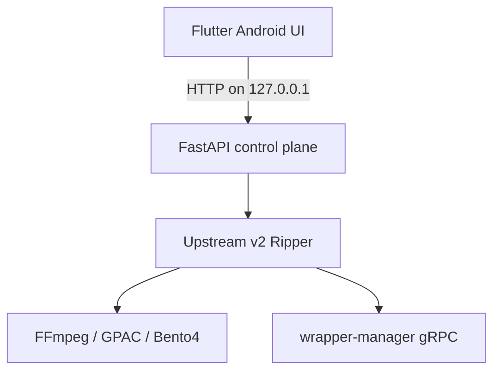

# Flutter Android client

The Flutter client is a mobile control surface for the upstream `v2` Python
core. The first release keeps the proven downloader/decryption pipeline in the
Termux Debian environment and talks to it over a loopback-only HTTP API. This
avoids shipping incompatible Python, FFmpeg, GPAC, Bento4 and gRPC binaries in
the APK while giving Android users a native Material UI.

> Use this software only with media you are legally entitled to access and
> process. The control API itself has no access-token protection. Prefer
> `127.0.0.1` or HTTPS, especially when using account login.

## 1. Install the backend in Termux

Follow the existing [Android deployment guide](../android-deploy.md) through
configuration, then install the optional server dependencies:

```shell
pd login debian
cd AppleMusicDecrypt
poetry install --with server
```

Recommended Android paths in `config.toml`:

```toml
[instance]
url = "wm.wol.moe"
secure = true

[download]
parallelNum = 2
maxRunningTasks = 4
dirPathFormat = "/sdcard/Music/{album_artist}/{album}"
playlistDirPathFormat = "/sdcard/Music/playlists/{playlistName}"
```

Start the loopback API:

```shell
poetry run python server.py --host 127.0.0.1 --port 10020
```

If wrapper-manager is an insecure gRPC service on `127.0.0.1:8080`, make the
protocol boundary explicit at launch:

```shell
poetry run python server.py \\
  --host 0.0.0.0 --port 10020 \\
  --manager-url 127.0.0.1:8080 --manager-insecure
```

The Flutter URL is then `http://<server-ip>:10020`. Port `8080` remains the
gRPC endpoint and must not be entered as the Flutter HTTP control API URL.

The backend is ready when this returns JSON:

```shell
curl http://127.0.0.1:10020/api/v1/health
```

## 2. Build the Flutter app

Install a current stable Flutter SDK and Android toolchain, then run:

```shell
cd flutter_app
flutter pub get
flutter run
```

For an APK:

```shell
flutter build apk --release
```

The output is `build/app/outputs/flutter-apk/app-release.apk`. The app defaults
to `http://127.0.0.1:10020`; change it in Settings if the API uses another
loopback port.

## Troubleshooting protocol errors

If `curl http://<host>:<port>/api/v1/health` reports HTTP/0.9, invalid request
method, or another HTTP/2-related error, that port is likely wrapper-manager
gRPC rather than the FastAPI control plane. Start `server.py` on a separate
HTTP port and configure Flutter to use that HTTP port.

## Apple Music account login

Use the account button in the app bar to log in, complete 2FA, list accounts
logged in during the current backend process, and log out. Passwords and 2FA
codes are kept only for the active login flow and are not persisted by the app
or FastAPI server. The bridge pauses and resumes the existing upstream gRPC
login stream; files under `src/grpc/` remain unchanged.

Remote plain HTTP is supported when explicitly confirmed in the warning dialog,
but Apple ID credentials and verification codes will cross the network without
TLS protection. Loopback HTTP or HTTPS is strongly preferred.

## Architecture



The API exposes health, account login/logout, enqueue, task list/speed, and
cancellation endpoints.
It does not duplicate or modify the upstream media pipeline. A future
standalone APK can replace the Python control plane behind the same API models
after every native dependency has a maintained Android ARM64 build.
